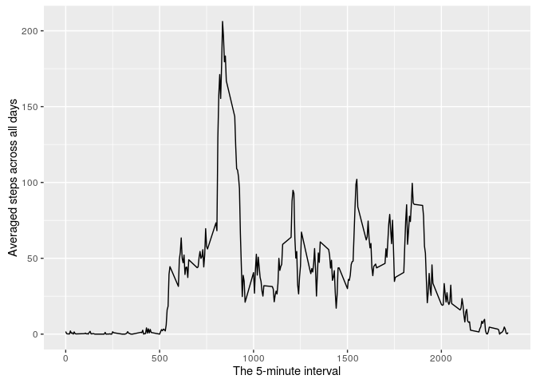

# Reproducible Research: Peer Assessment 1
Nicolas Azevedo Costa  
2016-10-23  

## Setting the importers

```r
library(ggplot2)
library(scales)
```

## Loading and preprocessing the data

```r
# 1 - Load the data
data = read.table(unz("activity.zip", "activity.csv"), sep=",", header=T)
# 2 - Transform to Date obj
data$date = as.Date(data$date, "%Y-%m-%d") 
```

## What is the mean total number of steps taken per day?

```r
# 1 - Calculate the total number of steps taken per day
steps_per_day = aggregate(steps~date,data, FUN=sum)

# 2 - Histogram of the total number of steps taken each day
ggplot(data=steps_per_day, aes(date, steps)) +
  stat_summary(fun.y=sum, geom="bar") +
  scale_x_date(labels = date_format("%Y-%m-%d")) +
    theme(axis.text.x = element_text(angle = 90, hjust = 1))
```

<!-- -->

```r
# 3 - Mean and median number of steps taken each day
spd_mean = mean(steps_per_day$steps)
spd_median = median(steps_per_day$steps)
```

The mean and median number os steps taken per day are, respectively, 10766.1887 and 10765.

## What is the average daily activity pattern?

```r
# Time series plot of the average number of steps taken
mean_steps_per_interval = aggregate(steps~interval, data, FUN=mean)
ggplot(mean_steps_per_interval, aes(interval, steps)) +
  geom_line() +
  xlab("The 5-minute interval") +
  ylab("Averaged steps across all days")
```

<!-- -->

The 5-minute interval that, on average, contains the maximum number of steps is 835 with 206.1698113.

## Imputing missing values


```r
# Code to describe and show a strategy for imputing missing data
missing_rows = sum(is.na(data$steps))
```

The total number of missing values in the dataset is 2304.

The strategy for filling all missing values is the mean for that 5-minute interval.

```r
# New dataset that is equal to the original dataset but with the missing data filled in.
new_data = data
for(i in 1:nrow(new_data)){
  if (is.na(new_data[i,"steps"])){
      new_data[i, "steps"] = mean_steps_per_interval[which(data$interval == data[i,"interval"]),"steps"][1]
  }
}
```

Histogram of the total number of steps taken each day after missing values are imputed:

```r
# Calculate the total number of steps taken per day
new_steps_per_day = aggregate(steps~date,new_data, FUN=sum)
# Histogram of the total number of steps taken each day
ggplot(data=new_steps_per_day, aes(date, steps)) +
  stat_summary(fun.y=sum, geom="bar") +
  scale_x_date(labels = date_format("%Y-%m-%d")) +
  theme(axis.text.x = element_text(angle = 90, hjust = 1))
```

<!-- -->

```r
# Mean and median number of steps taken each day
new_spd_mean = mean(new_steps_per_day$steps)
new_spd_median = median(new_steps_per_day$steps)
```

The mean and median number os steps taken per day are, respectively, 10766.1887 and 10766.1887. So, just the median differs a little bit from the first part of the assignment.

## Are there differences in activity patterns between weekdays and weekends?

Panel plot comparing the average number of steps taken per 5-minute interval across weekdays and weekends:

```r
# New factor variable in the dataset with two levels – “weekday” and “weekend”
weekdays1 = c('Monday', 'Tuesday', 'Wednesday', 'Thursday', 'Friday')
new_data$weekType = factor((weekdays(new_data$date) %in% weekdays1), 
                            levels=c(FALSE, TRUE), labels=c('weekend', 'weekday'))


new_mean_steps_per_interval = aggregate(steps~interval+weekType,new_data, FUN=mean)

ggplot(new_mean_steps_per_interval, aes(interval, steps, weekType)) + 
  geom_line() +
  xlab("The 5-minute interval") +
  ylab("Averaged steps across all days") +
  facet_wrap( ~ weekType, ncol=1)
```

<!-- -->
